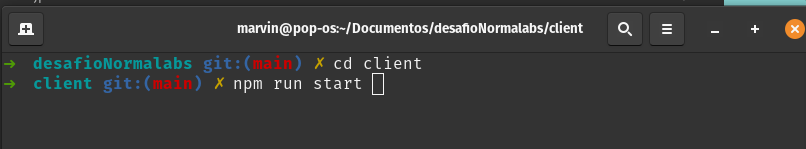

# Desafio Normalab

## Descrição do desafio

* O desafio consiste na criação de um portal(responsivo para mobile), que permita:

* Cadastrar novos usuários (Salvando suas devidas informações em um banco sqlite)
  
* Login de usuário (efetuar o login com o cadastro previamente efetuado)

## Funções 
**Contra cheque**
* Nessa aba o usuário poderá visualizar (e baixar) um PDF contendo seu último contra cheque. 

**Crachá Digital**
* Nessa aba o usuário poderá visualizar um crachá digital montado com sua imagem (enviado
no cadastro), este crachá deverá contar com frente e verso. Onde no verso estarão
informações básicas do mesmo. 

## Como rodar a aplicação ?

1° Passo - Na raiz do projeto entrar na pasta cliente e digitar ```npm run dev ``` conforme a imagem a baixo



2° Parro - **Abrir outro** terminal e na raiz do projeto entrar na pasta serve e digitar ```npm start```cofnorome a imagem a baixo


3° Passo abrir o local host fornecido pelo terminal do client

**OBS**: A aplicação precisa ter o client e o server rodando para funciona, ***também deve installar as bibliotecas em cada pasta com ```npm i``` tanto na pasta client como no server***


## Tecnologias utilizadas no front-end

* React
* HTML
* CSS

### Bibliotecas utilizada no front-end


## Tecnologias utilizada no back-end


## Links uteis

[Projeto no figma](https://www.figma.com/file/6OCComfk31TA1HMzBEXH4v/NormaLab?node-id=52%3A60)

[Armazena Imagem e gerar URL](https://postimg.cc/JD6M5Ynw/ea4747d3)


**BY ELISSON SALDANHA :)**